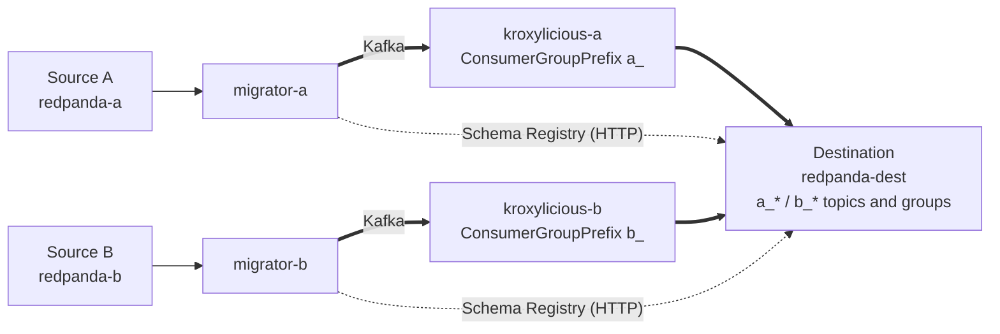

# Two Redpanda clusters into one, with Redpanda Migrator and Kroxylicious

This project merges two source Kafka clusters (Redpanda A and B) into one destination with Redpanda Migrator (Redpanda Connect 4.100.0), without the two sources' names colliding.

## The problem

Each source has topics, schemas and consumer groups with the same names, for example `orders` and `app-group`. On the destination they have to stay apart:

| What | How it's kept apart | By |
|---|---|---|
| Topics | `orders` → `a_orders` / `b_orders` | the migrator's `topic: 'a_${! @kafka_topic }'` interpolation |
| Schema subjects | `orders-value` → `a_orders-value` / `b_orders-value` | the migrator's `schema_registry.subject` interpolation |
| Consumer groups | `app-group` → `a_app-group` / `b_app-group` | **a custom Kroxylicious filter**, because the migrator has no group-rename option |

Without the filter, both migrators write the translated offsets of `app-group` into the same destination group, and the two sources overwrite each other.

## The solution



- **Topology:** one migrator and one Kroxylicious 0.24.0 proxy per source. Each migrator reads its source directly, and its Kafka output goes through its own proxy.
- **The filter:** the `ConsumerGroupPrefix` filter adds the prefix to the group ID on every group-related request (including batched `FindCoordinator` and `OffsetFetch`), and strips it again from the responses. Everything else passes through unchanged.
- **Schema Registry** is HTTP, so it goes straight to the destination.

After the migration, applications consume from the destination as `a_app-group` / `b_app-group` and resume where they stopped on the source.

## What's in the repo

| Path | Contents |
|---|---|
| [`docs/MIGRATOR_MULTI_SOURCE_TEST_PLAN.md`](docs/MIGRATOR_MULTI_SOURCE_TEST_PLAN.md) | The task specification (steps 1–3) |
| [`migrator-multisource-test/`](migrator-multisource-test/README.md) | The implementation: API inventory, filter, compose stacks, Go tests, runbooks |
| [`migrator-multisource-test/docs/findings.md`](migrator-multisource-test/docs/findings.md) | Results, deviations from the spec, known migrator and Redpanda issues |
| [`migrator-multisource-test/runbook/`](migrator-multisource-test/runbook/README.md) | Manual, step-by-step migration with live producers and consumers (plaintext) |
| [`migrator-multisource-test/runbook-tls-scram/`](migrator-multisource-test/runbook-tls-scram/README.md) | The same runbook with TLS + SASL/SCRAM-SHA-256 on every connection |
| `CLAUDE.md` | Guidance for working on the repo with Claude Code |

## Quick start

**Prerequisites:**
- Docker with Compose v2
- Go 1.26+
- network access to pull images the first time

No local Maven, JDK or rpk is needed; the filter is built inside Docker.

Automated tests, run from `migrator-multisource-test/`:

```sh
make filter-test   # filter unit tests
make step2         # proxy integration test on a fresh stack
make step3         # two sources -> one destination, end to end, then tear down
```

Manual walk-through with live traffic:

```sh
cd migrator-multisource-test/runbook             # or runbook-tls-scram for TLS + SCRAM
./00-setup.sh
./01-start-clusters.sh    # ... then each script prints the next one, up to 11
./99-teardown.sh
```

The plaintext stack and the TLS/SCRAM stack use different compose projects and host ports, so they can run at the same time. The plaintext runbook shares its stack with `make step3`, so don't run those two together.

## External sources

The published images are enough to run everything above. Only Step 1's reference check (`make step1-verify`) needs a source checkout: [Redpanda Connect](https://github.com/redpanda-data/connect) at tag `v4.100.0`, passed as `MIGRATOR_SRC`:

```sh
MIGRATOR_SRC=/path/to/connect make -C migrator-multisource-test step1-verify
```

## Versions

| Component | Version |
|---|---|
| Redpanda | `v26.2.2` |
| Redpanda Connect (migrator) | `4.100.0`, published image |
| Kroxylicious | `0.24.0` |
| franz-go | `v1.20.7`, kadm `v1.17.2`, kmsg `v1.12.0` (same as the migrator) |
