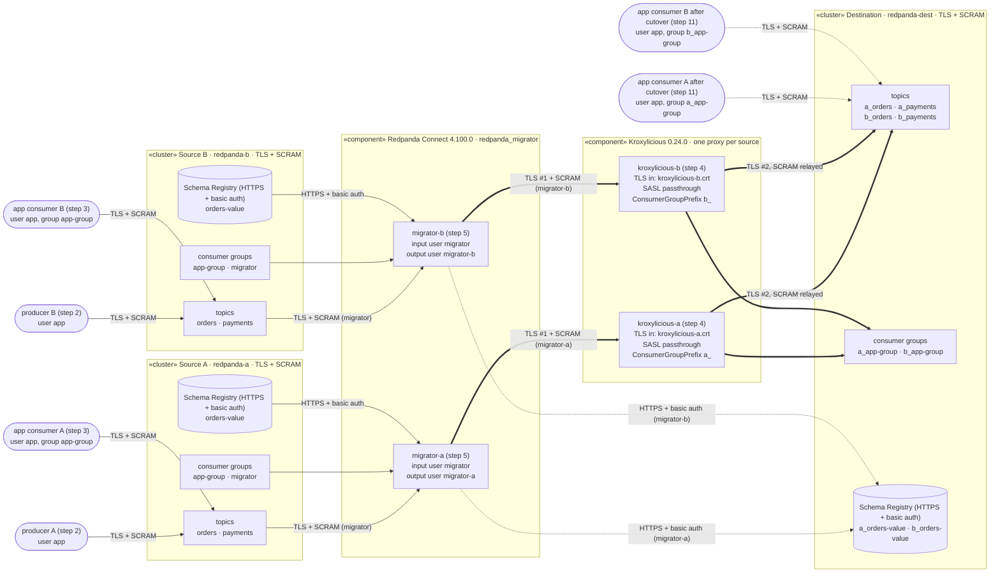

# Runbook: migrate two source clusters into one destination, with TLS and SASL/SCRAM

This is the TLS + SASL/SCRAM version of the [plaintext runbook](../runbook/README.md). The migration steps and checks are the same: sources A and B each have producers and an application consumer group `app-group`. One migrator per source replicates into a shared destination through its own Kroxylicious proxy, so the groups arrive as `a_app-group` and `b_app-group`. At the end, the consumers move to the destination and resume where they stopped.

The difference is that every connection is encrypted and authenticated:
- **Kafka listeners:** every listener on every cluster requires TLS (a private demo CA) and SASL SCRAM-SHA-256.
- **Schema Registry:** HTTPS with HTTP basic auth.
- **Proxies:** each proxy terminates TLS with its own certificate, opens a new TLS connection to the destination, and passes the SASL exchange through unchanged. The migrators therefore authenticate against the destination cluster itself.

The two runbooks are independent. This one has its own compose project (`cgprefix-tls-scram`), host ports, configs, `rbtool` copy and `.state/`, and none of the plaintext runbook's files are shared or changed. Results and deviations are in [FINDINGS.md](FINDINGS.md).

## Solution



### Security per hop

| Hop | Transport | Authentication |
|---|---|---|
| producers, consumers → `redpanda-a/b` | TLS, demo CA | SCRAM-SHA-256, user `app` |
| migrator input → `redpanda-a/b` | TLS | SCRAM, user `migrator` |
| migrator output → `kroxylicious-a/b:9192` | TLS #1, ended at the proxy (`kroxylicious-{a,b}.crt`) | SCRAM, `migrator-a` / `migrator-b`, **passed through** |
| `kroxylicious-a/b` → `redpanda-dest:9092` | TLS #2, started by the proxy (trusts the demo CA) | the migrator's SCRAM exchange, relayed unchanged |
| migrator → Schema Registries | HTTPS | basic auth: `migrator` (sources) / `migrator-a`, `migrator-b` (destination) |
| cutover consumers → `redpanda-dest` | TLS | SCRAM, user `app` |
| runbook checks (`rbtool`, `rpk`) | TLS | SCRAM, user `admin` |
| Admin API (`:9644`, healthcheck, user creation) | plaintext | none (see FINDINGS.md) |

- **Passthrough:** no SASL filter is configured on the proxies. In Kroxylicious 0.24.0 the proxy then forwards `SaslHandshake` / `SaslAuthenticate` unchanged, and the broker decides. SCRAM isn't bound to the TLS channel, so it survives the two separate TLS connections.
- **The filter:** the ConsumerGroupPrefix filter sees the decrypted group requests and rewrites them as in the plaintext runbook. It needs no change.
- **Authorization:** every user is a superuser (`redpanda/tls-scram/bootstrap-*.yaml`), so there are no ACLs. This runbook tests encryption and authentication, not authorization.

## Running it

Run the scripts in order from any directory, one at a time, and read each script's output before moving on. Every script is independent: it checks its preconditions and says what to run next.

**Prerequisites:** Docker with Compose v2, Go 1.26+, `curl`, and network access to pull images the first time. No local Maven, JDK, openssl or rpk is needed; certificates are generated with the openssl in the Redpanda image.

Start with `00-setup.sh`. It's safe to re-run: it only builds, pulls or generates what's missing or out of date.
- `FORCE=1 ./00-setup.sh` re-pulls and rebuilds everything, and regenerates the certificates and passwords. It skips the certificates and passwords while the stack is running.
- `FILTER_TESTS=1 ./00-setup.sh` also runs the filter's unit tests before building the proxy image.

| Script | Step | What it does | What to look for |
|---|---|---|---|
| `00-setup.sh` | 0 | Everything the plaintext setup does (images, proxy image, rbtool, lint, compose, ports), plus generating the demo CA, server certificates and SCRAM passwords into `.state/`, and checking each certificate against the CA | `Setup complete.` |
| `01-start-clusters.sh` | 1 | Starts the three clusters with TLS + SASL. Creates the SCRAM users. Checks each cluster's Kafka listener and Schema Registry | `check-auth` table all `OK`, `RESULT: OK`; each Schema Registry answers `admin 200, no credentials 401` |
| `02-start-producers.sh` | 2 | Creates `orders` (3 partitions) and `payments` (1) on both sources, registers `orders-value` in each source's Schema Registry, and starts a producer per source as `app` (`RATE` records/s per topic, default 20) | `started producer-a/b` |
| `03-start-consumers.sh` | 3 | Starts an `app-group` consumer per source as `app` (auto-commit) | Both groups `Stable`, offsets moving |
| `04-start-proxies.sh` | 4 | Starts `kroxylicious-a` (prefix `a_`) and `kroxylicious-b` (`b_`) with TLS on both sides, then runs the same auth checks **through each proxy**, as `migrator-a` / `migrator-b` | `check-auth` table all `OK`, `RESULT: OK` |
| `05-start-migrators.sh` | 5 | Starts `migrator-a` / `migrator-b`. Fails if their logs show TLS or authentication errors. Shows the proxies' latest group rewrites | Schemas and prefixed topics created, offsets committed, `app-group -> a_app-group` / `b_app-group` rewrites |
| `06-check-data.sh` | 6 | Measures the destination twice, 15 s apart, and checks the copied schemas | `RESULT: OK`, `schemas OK: a_orders-value and b_orders-value copied` |
| `07-check-offsets.sh` | 7 | Compares each source `app-group` position with its translation | Never `AHEAD`. `behind by N` is expected while consumers run |
| `08-stop-consumers.sh` | 8 | Stops the source consumers; each commits its final position and leaves | Both groups `Empty` |
| `09-stop-producers.sh` | 9 | Stops the producers | Final counts |
| `10-wait-replication-and-stop-migrators.sh` | 10 | Waits until the destination has every record and every translated position is exact, then stops the migrators | Lag 0, all partitions `exact`, `migrators stopped` |
| `11-cutover-consumers.sh` | 11 | Consumes the destination as `a_app-group` / `b_app-group` (user `app`) until idle. Then checks the resume points, and that every record was consumed exactly once | `OK: resumed exactly` and `every record exactly once` everywhere; both `RESULT: OK` |
| `99-teardown.sh` | | Stops everything, deletes containers, data and `.state/` (certificates and passwords too) | |

### The auth checks (steps 1 and 4)

`rbtool check-auth` connects to each endpoint five ways and sends a Metadata request. It doesn't use a ping, because brokers answer `ApiVersions` before authentication, so a ping would pass even without credentials.

| Attempt | Expected |
|---|---|
| TLS + the right SCRAM credentials | accepted |
| plaintext + SCRAM | refused (the TLS listener closes the connection) |
| TLS, no SASL | refused |
| TLS + wrong password | refused **with `SASL_AUTHENTICATION_FAILED`** |
| TLS, trusting only the system CAs | refused **with an x509 verification error** |

In step 4 the endpoints are the proxies (`localhost:19192` / `:29192`). A wrong password is rejected by `redpanda-dest`, and the proxy passes that error back. This shows the migrators really authenticate against the destination through the proxy.

## How positions are checked

Positions are checked the same way as in the plaintext runbook. See [How positions are checked](../runbook/README.md#how-positions-are-checked) and [Why step 7 shows "behind" and step 10 insists on "exact"](../runbook/README.md#why-step-7-shows-behind-and-step-10-insists-on-exact). In short:
- **Offset header:** every destination record carries the source offset it was copied from (`x-source-offset`).
- **Step 7:** tolerates positions that are behind.
- **Step 10:** waits until every translated position is exact.
- **Step 11:** checks each partition's resume point, and that the source and destination consumers together read every source record exactly once. `ALLOW_DUPLICATES=1` reports duplicates without failing.

Don't start destination consumers while the migrators are running; step 11 refuses to.

## Files and processes

- **`lib.sh`:** shared settings and helpers. On top of the plaintext helpers it has:
  - `ensure_certs` / `ensure_secrets`: generate the certificates and passwords.
  - `as_app`: runs rbtool as the `app` user.
  - `rpk_in`: runs rpk inside a cluster container over TLS + SCRAM.
  - `create_user`, `sr_curl`.
- **`certs/gen-certs.sh`:** writes the demo CA and one server certificate per broker and per proxy. Each certificate's SANs are its service name, `localhost` and `127.0.0.1`.
- **`rbtool/`:** a copy of `../runbook/rbtool`, on the same franz-go versions.
  - Every client connects with TLS and SCRAM, configured by `RB_TLS_CA`, `RB_SASL_USER`, `RB_SASL_PASS` and `RB_SASL_MECHANISM` (lib.sh sets them).
  - It adds the `check-auth` subcommand.
- **`.state/`:**
  - Everything the plaintext runbook keeps there: PIDs, logs, consumed-record logs.
  - `tls/`: CA, certificates and keys.
  - `secrets.env`: generated SCRAM passwords, mode 0600.
  - It's git-ignored and removed by `99-teardown.sh`.
- **Infrastructure (all new files, used only by this runbook):**

  | File | Contents |
  |---|---|
  | `../compose/docker-compose.tls-scram.yaml` | The stack |
  | `../redpanda/tls-scram/redpanda.yaml.tmpl` | Listener config: TLS + SASL on Kafka, HTTPS + basic auth on Schema Registry |
  | `../redpanda/tls-scram/bootstrap-{source,dest}.yaml` | `enable_sasl` and superusers |
  | `../migrator/tls-scram/migrator-{a,b}.yaml` | Migrator configs |
  | `../proxy/config-tls-scram-{a,b}.yaml` | Proxy configs |

- **Host ports:**

  | | Kafka | Schema Registry | Admin |
  |---|---|---|---|
  | A | 19093 | 18082 | 19645 |
  | B | 29093 | 28082 | 29645 |
  | dest | 39093 | 38082 | 39645 |

  - Proxies: bootstrap on 19192 / 29192, metrics on 19191 / 29191.
  - These don't overlap with the plaintext runbook or `make step3`, so you can run either of those at the same time as this one.

The compose file reads the SASL passwords from the environment, so run `docker compose` with `.state/secrets.env` loaded. Useful commands while it runs:

```sh
tail -f .state/logs/producer-a.log .state/logs/consumer-a.log
bash -c 'source ./lib.sh; "${COMPOSE[@]}" logs -f migrator-a'
bash -c 'source ./lib.sh; "${COMPOSE[@]}" logs kroxylicious-a' | grep ConsumerGroupPrefixFilter
bash -c 'source ./lib.sh; rpk_in redpanda-dest group list'
curl --cacert .state/tls/ca.crt -u "admin:$(grep ADMIN .state/secrets.env | cut -d= -f2)" https://localhost:38082/subjects
```
