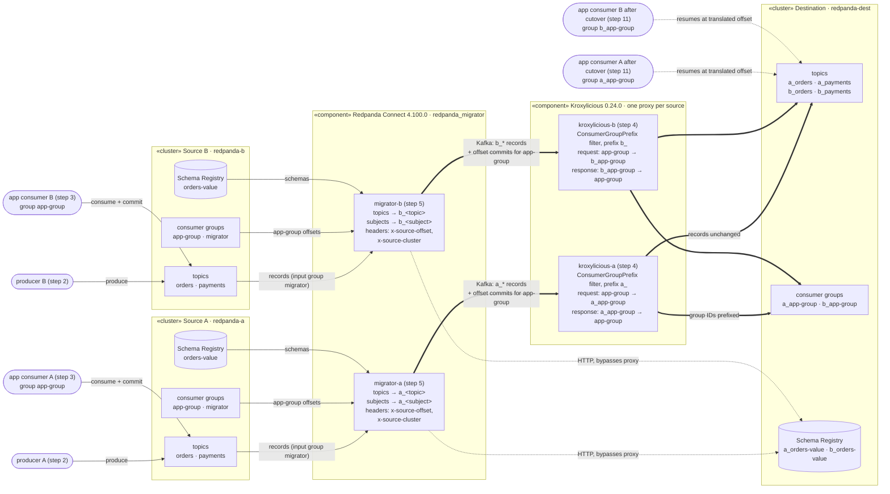

# Runbook: migrate two source clusters into one destination

This is a manual walk-through of a full migration with live traffic. Sources A and B each have producers and an application consumer group `app-group`. One migrator per source replicates into a shared destination, through its own Kroxylicious proxy, so the groups arrive as `a_app-group` and `b_app-group`. At the end, the consumers move to the destination and resume where they stopped.

## Solution



- **Thick arrows** are Kafka traffic from each migrator's output. It all goes through that source's own proxy: records, topic creation, and consumer group offset commits.
- **Thin arrows** are direct connections: the applications on the sources, and each migrator's input reading its source (records, `app-group` offsets, schemas).
- **Dotted arrows** go around the proxies. Schema Registry traffic is HTTP, so it goes straight to the destination; the dotted consumer arrows show the applications after the cutover.

The migrator keeps topic and group names apart differently. It prefixes topics and schema subjects itself (`topic` / `subject` interpolation). It can't rename consumer groups, so the proxy's ConsumerGroupPrefix filter does that: it rewrites `app-group` to `a_app-group` on every group request and strips the prefix again from responses. Nothing else is changed. Without the proxies, both sources would share one `app-group` on the destination.

## Running it

Run the scripts in order from any directory, one at a time, and read each script's output before moving on. Every script is independent: it checks its preconditions and says what to run next.

**Prerequisites:** Docker with Compose v2, Go 1.26+, and network access to pull images the first time. No local Maven or JDK is needed; the proxy filter is compiled inside its Docker build.

Start with `00-setup.sh`. It's safe to re-run, and it only builds or pulls what's missing or out of date:
- `FORCE=1 ./00-setup.sh` re-pulls and rebuilds everything.
- `FILTER_TESTS=1 ./00-setup.sh` also runs the filter's 58 unit tests before building the proxy image.
- Setup rebuilds the proxy image whenever a file in `../kroxylicious-filter/` is newer than the image.

| Script | Step | What it does | What to look for |
|---|---|---|---|
| `00-setup.sh` | 0 | Checks prerequisites. Pulls images, builds the proxy image and rbtool (only what's missing or out of date), lints the migrator configs, and warns about busy ports or a running stack | `Setup complete.` |
| `01-start-clusters.sh` | 1 | Starts `redpanda-a`, `redpanda-b`, `redpanda-dest` | Addresses printed |
| `02-start-producers.sh` | 2 | Creates `orders` (3 partitions) and `payments` (1) on both sources; starts a producer per source (`RATE` records/s per topic, default 20) | `started producer-a/b` |
| `03-start-consumers.sh` | 3 | Starts an `app-group` consumer per source (auto-commit) | Both groups `Stable`, offsets moving |
| `04-start-proxies.sh` | 4 | Starts `kroxylicious-a` (prefix `a_`) and `kroxylicious-b` (`b_`) in front of the destination; builds the image if needed | Both healthy |
| `05-start-migrators.sh` | 5 | Starts `migrator-a` / `migrator-b`, each writing through its own proxy | Prefixed topics created, offsets committed |
| `06-check-data.sh` | 6 | Measures the destination twice, 15 s apart | Every `a_*` / `b_*` topic grows, lag small, values and `x-source-cluster` from the right source, `RESULT: OK` |
| `07-check-offsets.sh` | 7 | Compares each source `app-group` position with its translation in `a_app-group` / `b_app-group` | Never `AHEAD`. `behind by N` is expected while consumers run (see below) |
| `08-stop-consumers.sh` | 8 | Stops the source consumers; each commits its final position and leaves | Both groups `Empty` |
| `09-stop-producers.sh` | 9 | Stops the producers | Final counts |
| `10-wait-replication-and-stop-migrators.sh` | 10 | Waits until the destination holds every source record **and** every translated position is exact, then stops the migrators | Lag 0, all partitions `exact`, `migrators stopped` |
| `11-cutover-consumers.sh` | 11 | Consumes the destination as `a_app-group` / `b_app-group` until idle. Then checks each partition's resume point, and that every source record was consumed exactly once across source and destination | `OK: resumed exactly` everywhere; `every record exactly once` everywhere; both `RESULT: OK` |
| `99-teardown.sh` | | Stops everything, deletes containers, data and `.state/` | |

## How positions are checked

The migrators run with `offset_header: "x-source-offset"`, so every destination record carries the source offset it was copied from. The checks read that header instead of assuming the two sides use the same offset numbers:
- **Steps 7 and 10:** the destination record just before a translated position gives the source offset that position corresponds to. Its value must also match the source record at that offset.
- **Step 11, resume point (`verify-cutover`):** the first record each destination consumer reads, per partition, must be the source record at the source group's final committed offset. A lower offset means re-reads, which are reported; a higher one means skipped records, which fails the check.
- **Step 11, duplicates and gaps (`check-duplicates`):** the source consumers' logs (step 3 on) and the destination consumers' logs are combined, with destination records mapped to their source offset. Every source offset, from each partition's start to its end, must have been consumed **exactly once**.
  - Duplicates are reported by where they happened: `re-read after cutover` (read on the source and again on the destination), `repeated on source`, or `repeated on destination`.
  - Gaps show as `never consumed`.
  - Gaps always fail. Duplicates fail too, unless you run step 11 with `ALLOW_DUPLICATES=1`, for applications where at-least-once delivery is acceptable.

## Why step 7 shows "behind" and step 10 insists on "exact"

While the source consumers run, they keep committing, and the migrators sync group offsets every 10 s. So the translated position trails the live one. Groups with active members also get timestamp-based translation, which can land behind the true position when many records share a timestamp. A position behind the source means re-reads after cutover; it never means lost records.

After step 8 the groups are `Empty`, and each consumer's final commit changes the source offset. On its next sync the migrator translates that commit **exactly**. Step 10 waits for this before stopping the migrators. If it doesn't converge, step 10 fails and leaves the migrators running. That can happen when a group's final position didn't change after its consumers stopped (known issue 1 in `../docs/findings.md`) or after a migrator restart (known issues 2–3).

Don't start destination consumers while the migrators are still running. The migrators' commits to a group with live members are rejected (`UNKNOWN_MEMBER_ID`), so the group stops syncing. Step 11 refuses to run until the migrators have stopped.

## Files and processes

- `lib.sh`: shared settings and helpers (addresses, compose command, background processes).
- `rbtool/`: Go helper, built automatically into `.state/bin/rbtool`. Subcommands: `create-topics`, `produce`, `consume`, `check-data`, `check-offsets`, `verify-cutover`. It uses the migrator's franz-go versions.
- `.state/`: PID files, process logs (`logs/`), and consumed-record logs (`consumed-source-{a,b}.jsonl`, `consumed-dest-{a,b}.jsonl`, one JSON line per record, including `source_offset` on the destination side). Git-ignored and removed by `99-teardown.sh`.
- Infrastructure: `../compose/docker-compose.step3.yaml`, with migrator configs in `../migrator/` and proxy configs in `../proxy/config-step3-{a,b}.yaml`. **Don't run `make step3` at the same time**; they share containers and ports.

Useful while it runs:

```sh
tail -f .state/logs/producer-a.log .state/logs/consumer-a.log
docker compose -f ../compose/docker-compose.step3.yaml --profile migrators logs -f migrator-a
docker compose -f ../compose/docker-compose.step3.yaml logs kroxylicious-a | grep ConsumerGroupPrefixFilter
```
